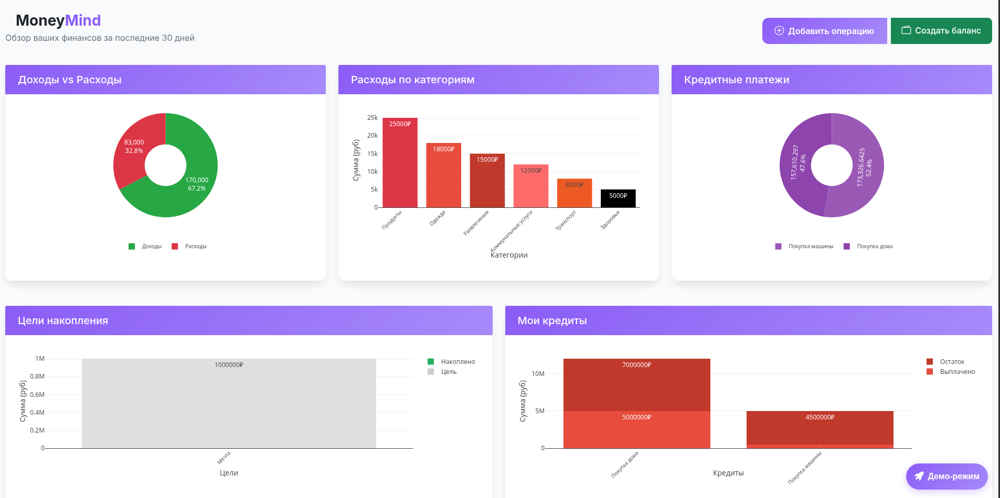
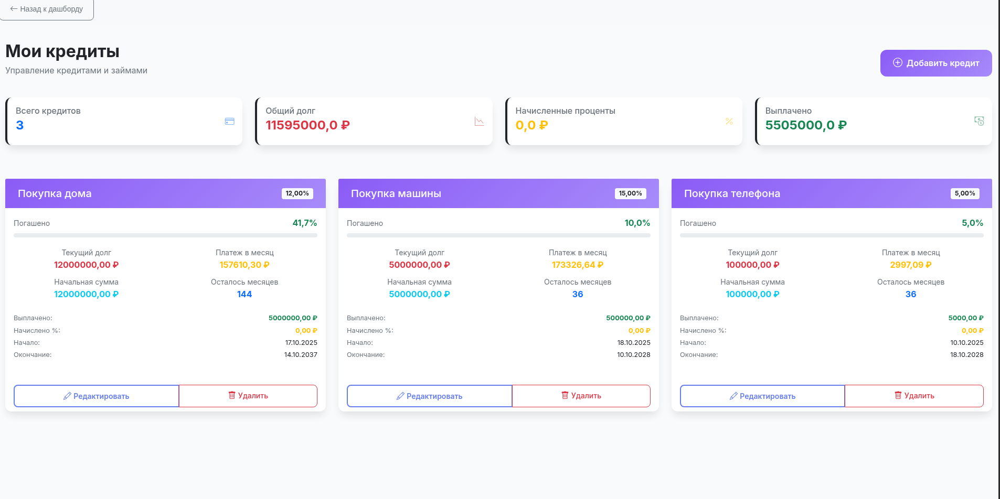

# MoneyMind - Система управления личными финансами

[](https://www.djangoproject.com/)
[](https://www.python.org/)
[](https://getbootstrap.com/)
[](https://www.postgresql.org/)
[](https://plotly.com/)

MoneyMind - это полнофункциональное веб-приложение для управления личными финансами, разработанное на Django. Система предоставляет инструменты для учета доходов и расходов, планирования бюджета, отслеживания финансовых целей и управления кредитами.

## 📸 Скриншоты

### 🏠 Главная страница


### 📊 Дашборд с аналитикой


### 🏦 Управление кредитами


## 🚀 Основные функции

### 💰 Управление транзакциями
- Учет доходов и расходов с категоризацией
- Автоматическое заполнение даты операций
- Гибкая система категорий (доходы/расходы)
- История транзакций с фильтрацией

### 🎯 Цели накопления
- Постановка финансовых целей с указанием сроков
- Визуализация прогресса накоплений
- Приоритизация целей
- Расчет ежемесячных взносов

### 🏦 Управление кредитами
- Учет кредитов и займов
- Расчет аннуитетных платежей
- Отслеживание процентных ставок
- Графики погашения и прогресс выплат

### 📊 Аналитика и отчетность
- Интерактивные диаграммы и графики (Plotly)
- Визуализация доходов/расходов по категориям
- Расчет свободных средств после обязательных платежей
- Единый формат отображения сумм (0.00 ₽)

## 🛠️ Технологии

**Backend:** 
- Django 5.2.6 - основной веб-фреймворк
- Django ORM - работа с базой данных
- Django Authentication - система аутентификации
- Django Forms - обработка форм
- Django Templates - шаблонизация

**Frontend:**
- HTML5 - семантическая разметка
- CSS3 - стилизация и анимации
- Bootstrap 5 - адаптивная верстка
- JavaScript - интерактивность
- Plotly 5.17.0 - интерактивные графики

**База данных:** 
- PostgreSQL - основная реляционная БД (продакшен)
- SQLite - встроенная БД (разработка)

## 📋 Системные требования
- Python 3.8+, Pip, PostgreSQL 13+, Современный браузер

## 🎮 Демо-режим

Приложение включает функцию создания демонстрационных данных:
- Примеры транзакций (доходы/расходы)
- Демо-кредиты с разными условиями
- Цели накопления с прогрессом
- Готовые графики и аналитика

После регистрации используйте панель "Демо-режим" для быстрого ознакомления с функционалом.

## 🚀 Установка и запуск

```bash
# Клонирование репозитория
git clone https://github.com/LaptevAndr/Portfolio.git
cd Portfolio/MoneyMind

# Настройка виртуального окружения
python -m venv venv

# Активация окружения:
# Linux/MacOS: source venv/bin/activate
# Windows: venv\Scripts\activate

# Установка зависимостей
pip install -r requirements.txt

# Настройка базы данных
python manage.py makemigrations
python manage.py migrate

# Создание администратора (опционально)
python manage.py createsuperuser

# Запуск сервера разработки
python manage.py runserver